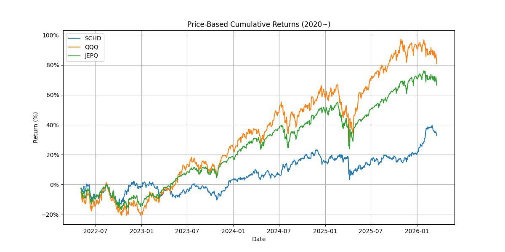
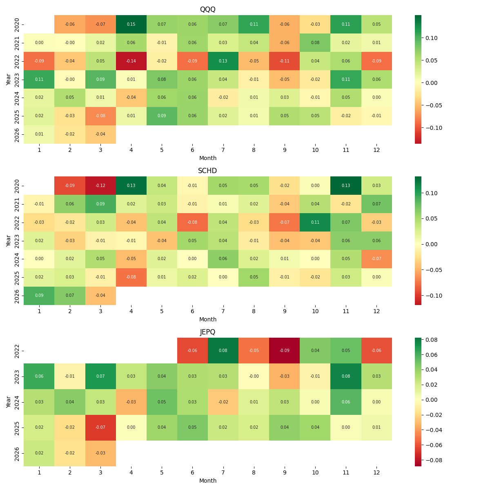
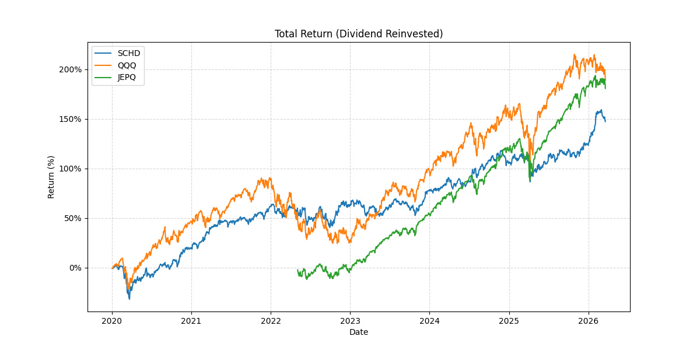

# ETF Analysis Project

A data-driven ETF analysis project using Python (yfinance, pandas, matplotlib).

This project analyzes ETF performance from multiple perspectives:

---

## 📈 Price Return

---

## 📊 Monthly Return (Heatmap)

---

## 💰 Total Return (Dividend Included)

---

## 🔄 Reinvestment Effect

---

## 📊 Key ETFs

- QQQ: Growth-focused ETF  
- SCHD: Dividend-focused ETF  
- JEPQ: High-yield income ETF  

---

## 📁 Structure

- Day1: Project Planning  
- Day2: Data Collection  
- Day3: Price Return Analysis  
- Day4: Monthly Heatmap  
- Day5: Total Return  
- Day6: Reinvestment Effect  
- Day7: Final Conclusion  
